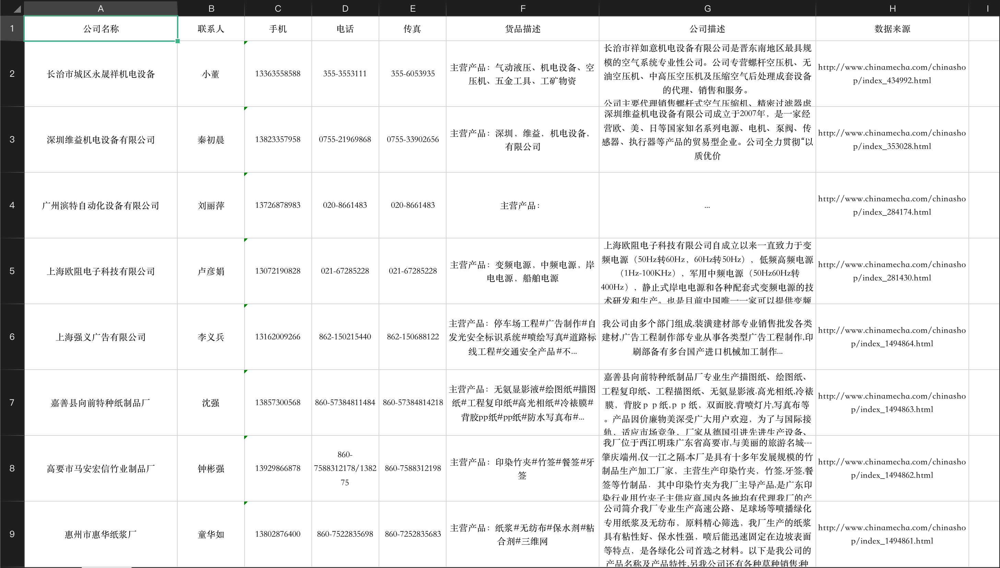

# 安装插件

该插件依赖[sunday](https://github.com/pysunday/pysunday), 需要先安装sunday

执行sunday安装目录：`sunday_install tools-chinamecha`

## chinamecha命令使用

```bash
 $ chinamecha -h

usage: chinamecha [-t TYPENAME [TYPENAME ...]] [-l] [-T THREAD_NUM] [-r RANGE] [-v] [-h] [--loglevel LEVEL]

机电一体化网供应商信息采集

Optional:
  -t TYPENAME [TYPENAME ...], --type TYPENAME [TYPENAME ...]  类型
  -l, --list                                                  全部类型
  -T THREAD_NUM, --thread THREAD_NUM                          线程数
  -r RANGE, --range RANGE                                     采集范围
  -v, --version                                               当前程序版本
  -h, --help                                                  打印帮助说明
  --loglevel LEVEL                                            日志等级（debug、info、warning、error、critical）,  默认debug

使用案例:
    chinamecha -l
    chinamecha -t 电机 通信线 -T 20
    chinamecha -T 10 --loglevel warning

```

## 数据结果


